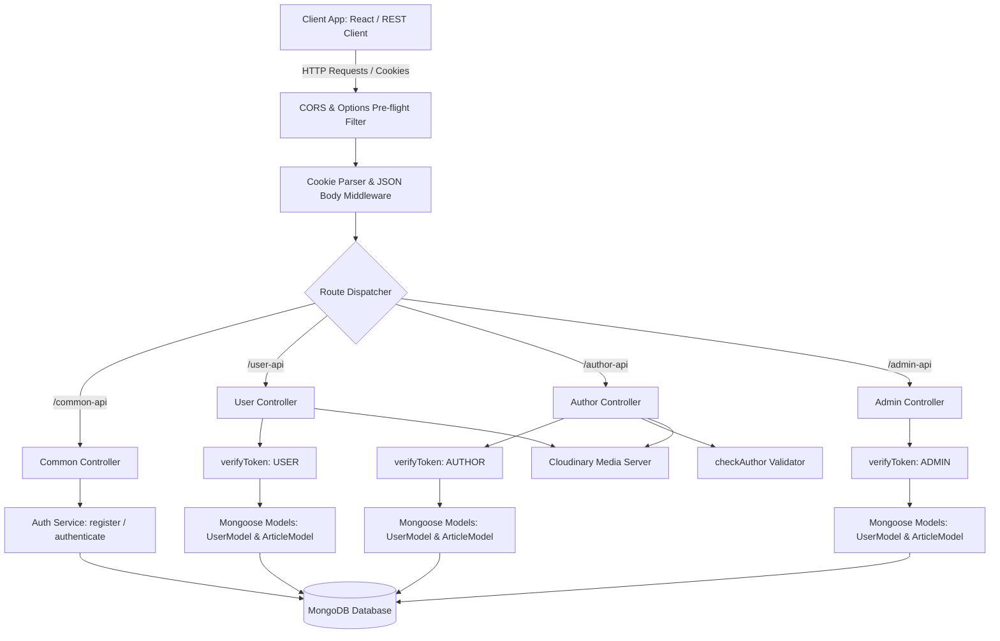

# Blog App Backend - MERN Capstone API

A robust, enterprise-grade, secure RESTful API built on the MERN stack for a multi-role Blogging Platform. This API supports custom authentication, rich role-based access control (RBAC), secure media uploads via Cloudinary, and dynamic interaction features (like article feeds, comments, and status controls).

---

## Tech Stack & Key Integrations

* **Core Server Framework:** Node.js & Express (v5.x for modern routing capabilities)
* **Database & Object Modeling:** MongoDB & Mongoose (Schema validation, populated relations, and custom cascade rules)
* **Security & Encryption:** JWT (JSON Web Tokens) with dual Cookie/Header authorization support, bcryptjs (10-round salt password hashing)
* **Media Hosting & Storage:** Cloudinary API integrated with a custom Multer memory buffer pipeline
* **Config Management:** Dotenv for secure local and staging environment variables
* **API Testing Framework:** Integrated REST Client HTTP test suite (`req.http`)

---

## Architecture & Flow Diagram

The following architecture diagram represents the request-response lifecycle from the client app down to the database and external cloud integrations:



---

## Project Directory Structure

Here is a high-level mapping of the project's codebase:

```text
BLOG-APP-BACKEND/
├── APIs/ # REST Controllers & Routes
│ ├── AdminAPI.js # Admin endpoints (moderation, blocking, listings)
│ ├── AuthorAPI.js # Author endpoints (article management, soft-delete)
│ ├── commonAPI.js # Common endpoints (login, logout, token check, reset password)
│ └── UserAPI.js # User endpoints (registration, feed, comments)
├── models/ # Mongoose Database Schemas
│ ├── ArticleModel.js # Article & Nested Comments Schemas
│ └── UserModel.js # User, Author, & Admin Schema with Role configurations
├── Services/ # Business Logic & Core Handlers
│ └── authService.js # User registration, bcrypt hashing, JWT signature service
├── Config/ # Service Integrations & Configurations
│ ├── cloudinary.js # Cloudinary SDK wrapper initialization
│ ├── clodinaryUpload.js # Buffer stream promise wrapper for image uploads
│ └── multer.js # File filter validation & RAM limit controls
├── middlewares/ # Global Express interceptors
│ ├── checkAuthor.js # Validates author profile matches & checks activity
│ └── verifyToken.js # JWT token decoder (extracts from authorization header OR cookie)
├── .env # Local server configuration variables (ignored in Git)
├── package.json # Application dependencies & starting scripts
├── req.http # Pre-defined HTTP REST Client test suite
└── server.js # Application entry point, DB connector, & error middlewares
```

---

## Environment Configuration

To run this backend, create a `.env` file in the root folder of the project (`BLOG-APP-BACKEND`) with the following keys. Note that in serverless or cloud platforms like **Vercel** or **Render**, the application port is dynamically assigned at runtime; however, a default local port needs to be specified for local development:

```ini
# Application Running Port (Defaults to 4000 locally; ignored/overridden dynamically in Vercel/Render)
PORT=4000

# Database Connection string (MongoDB Atlas or Local MongoDB)
DB_URL=your_mongodb_connection_string

# Encryption secrets
JWT_SECRET=your_jwt_signature_secret_key

# Cloudinary Integration API credentials
CLOUDINARY_CLOUD_NAME=your_cloudinary_cloud_name
CLOUDINARY_API_KEY=your_cloudinary_api_key
CLOUDINARY_API_SECRET=your_cloudinary_api_secret
```

---

## Database Schemas & Data Models

### 1. User Model (`user`)
Represents readers, creators, and moderators. Saved under `models/UserModel.js`.

| Field | Type | Attributes | Description |
| :--- | :--- | :--- | :--- |
| `username` | String | Required | Unique handle for the user |
| `firstName` | String | Required | First name of the account owner |
| `lastName` | String | Optional | Last name of the account owner |
| `email` | String | Required, Unique | Email address used for authentication |
| `password` | String | Required | Encrypted password (hashed with bcryptjs) |
| `profileImageUrl` | String | Optional (Default: `""`) | Cloudinary URL hosting the user's avatar |
| `role` | String | Required, Enum | Role profile: `USER`, `AUTHOR`, or `ADMIN` |
| `isActive` | Boolean | Default: `true` | Account status flag. If `false`, access is blocked |

### 2. Article Model (`article`)
Represents published posts and reader comments. Saved under `models/ArticleModel.js`.

| Field | Type | Attributes | Description |
| :--- | :--- | :--- | :--- |
| `author` | ObjectId | Required, Ref `user` | Reference to the author profile |
| `title` | String | Required | Header title of the article |
| `category` | String | Required | Tag category of the post |
| `content` | String | Required | Body content (Markdown/HTML/Text) |
| `comments` | Array | Subdocument Array | Nested comments referencing user ID and comment text |
| `isArticleActive` | Boolean | Default: `true` | Status flag for Soft-Deletes / Moderation |

---

## API Reference Guide

### Public & Common Routes (`/common-api`)
*Base Path: `/common-api`*

| Method | Endpoint | Access | Headers | Body / Parameters | Description |
| :--- | :--- | :--- | :--- | :--- | :--- |
| **POST** | `/login` | Public | `Content-Type: application/json` | `{ email, password }` | Authenticates users, returns user payload, and sets an `httpOnly` cookie. |
| **GET** | `/logout` | Public | None | None | Clears the authorization HTTP-Only token cookie. |
| **GET** | `/check-auth` | Authenticated | Auth Token | None | Validates current token, returns full profile details. |
| **PUT** | `/change-password` | Public | `Content-Type: application/json` | `{ email, newpassword }` | Updates passwords in the database (hashes the new password). |

### Reader/User Routes (`/user-api`)
*Base Path: `/user-api`*

| Method | Endpoint | Access | Headers | Body / Parameters | Description |
| :--- | :--- | :--- | :--- | :--- | :--- |
| **POST** | `/users` | Public | `multipart/form-data` | Form Fields + `profilePic` image | Registers a new `USER` with an optional avatar uploaded to Cloudinary. |
| **GET** | `/articles` | `USER` | Auth Token | Query: `?category=Tech` | Reads all active articles sorted by newest first. |
| **GET** | `/articles/:id` | `USER` | Auth Token | Parameter: `:id` | Gets details for a specific active article along with authors and commenters. |
| **PUT** | `/articles/comments` | `USER` | Auth Token | `{ articleId, commentId, comment }` | Modifies an existing comment or Adds a new one. |

### Creator/Author Routes (`/author-api`)
*Base Path: `/author-api`*

| Method | Endpoint | Access | Headers | Body / Parameters | Description |
| :--- | :--- | :--- | :--- | :--- | :--- |
| **POST** | `/users` | Public | `multipart/form-data` | Form Fields + `profilePic` image | Registers a new creator profile (`AUTHOR`) with an avatar. |
| **POST** | `/articles` | `AUTHOR` | Auth Token | `{ title, category, content }` | Publishes a new article in the database under their profile. |
| **GET** | `/articles/:authorId` | `AUTHOR` | Auth Token | Parameter: `:authorId` | Fetches all articles (active and deactivated) belonging to the author. |
| **PUT** | `/articles` | `AUTHOR` | Auth Token | `{ articleId, title, content, category }` | Updates article fields (validates creator ownership). |
| **PUT**| `/articles/deactivate`| `AUTHOR`| Auth Token | `{ article_id, author }` | Performs soft-delete of an article. |
| **PUT**| `/articles/activate`| `AUTHOR`| Auth Token | `{ article_id, author }` | Performs reactivation of an article. |

### Admin/Moderation Routes (`/admin-api`)
*Base Path: `/admin-api`*

| Method | Endpoint | Access | Headers | Body / Parameters | Description |
| :--- | :--- | :--- | :--- | :--- | :--- |
| **GET** | `/users` | `ADMIN` | Auth Token | None | Retrieves lists of all registered users (excluding passwords). |
| **GET** | `/articles` | `ADMIN` | Auth Token | None | Retrieves all articles (active and deactivated) for moderation. |
| **PUT** | `/block-user/:id` | `ADMIN` | Auth Token | Parameter: `:id` | Disables user account status, preventing them from logging in. |
| **PUT** | `/unblock-user/:id` | `ADMIN` | Auth Token | Parameter: `:id` | Restores blocked accounts to active status. |

---

## Custom Middlewares & Security Stack

### 1. Token Verification Middleware (`verifyToken.js`)
Extremely flexible auth middleware that extracts incoming JWTs from **either**:
* The `Authorization` header (`Bearer <token>`)
* `token` stored inside secure `req.cookies`

Handles expired sessions (`TokenExpiredError`) and invalid keys (`JsonWebTokenError`) gracefully, while verifying user roles against allowed access parameters before letting requests hit routers.

### 2. Activity & Author Validation (`checkAuthor.js`)
Peracts custom validations specifically for authors:
* Resolves and verifies that the `authorId` exists in the database.
* Enforces security checks to confirm the user account is active (`isActive === true`) and holds the role of `AUTHOR` before allowing articles creation/modification.

### 3. Body Parsing & Security Rules
* **CORS (Cross-Origin Resource Sharing):** Explicitly maps allowed clients (`http://localhost:5173` and production URLs) with credentials enabled.
* **OPTIONS pre-flight resolution:** Custom middleware answers client OPTIONS queries immediately to prevent express routing conflicts.
* **Multer constraints:** Restricts file sizes to **2MB** and restricts content type strictly to **JPG/PNG** to prevent RAM overflow or malicious uploads.

---

## Getting Started & Local Setup

### Prerequisites
1. **Node.js:** Ensure Node.js v18+ is installed on your workstation.
2. **Database:** A MongoDB instance running locally, or a MongoDB Atlas URI connection string.
3. **Media Hosting:** A Cloudinary Account for developer image storage API keys.

### Installation Instructions
1. Navigate to the repository backend folder and install package dependencies:
 ```bash
 cd BLOG-APP-BACKEND
 npm install
 ```
2. Configure your environment file by creating a new `.env` file in the root directory (see **[Environment Configuration](#-environment-configuration)** above).
3. Boot the application backend:
 ```bash
 npm run dev
 ```
 *The console should output: `Server started on port 4000` followed by `DB connection success`.*

---

## Cloud Deployment & Hosting Mappings

This production-ready backend application is successfully deployed as a live web service on **Vercel** (or **Render**):

 **Live Production API Base URL:** `https://blog-app-api-peach-gamma.vercel.app`

---

### 1. Dynamic Port Allocation on Cloud Services (Render / Vercel)
You **do not** need to manually configure or hardcode the `PORT` environment variable on your live hosting dashboard.
- In `server.js`, the Express app listens dynamically: `const PORT = process.env.PORT || 4000;`.
- Hosting providers automatically assign a variable port under `process.env.PORT` at startup and bind it to standard web ports (`80` for HTTP / `443` for secure HTTPS).
- Consequently, your live API URL does not require any port suffix.

### 2. Environment Variables Configuration
Do not commit or upload your local `.env` file to GitHub or your cloud provider. Instead, configure these values securely under **Project Settings > Environment Variables** on the Vercel or Render dashboard:
- `DB_URL` *(Your production MongoDB Atlas connection string)*
- `JWT_SECRET` *(Your production cryptographically secure signature secret)*
- `CLOUDINARY_CLOUD_NAME`, `CLOUDINARY_API_KEY`, `CLOUDINARY_API_SECRET` *(Your Cloudinary credentials)*

### 3. Serverless Routing Configuration (`vercel.json`)
If you deploy this application as a single-entry serverless Express function on Vercel, ensure you have a `vercel.json` file in your root directory routing all requests to `server.js`:
```json
{
 "version": 2,
 "builds": [
 {
 "src": "server.js",
 "use": "@vercel/node"
 }
 ],
 "routes": [
 {
 "src": "/(.*)",
 "dest": "server.js"
 }
 ]
}
```

---

## Testing with REST Client (`req.http`)

The workspace includes a complete suite of mock request tests inside `req.http`. 

To utilize this suite:
1. Install the **REST Client** extension in VS Code.
2. Open `req.http`.
3. Click the **`Send Request`** button appearing above the respective HTTP methods.
4. Test full endpoints, registration body formats, logins, comment editing, user blocking, and authentication checks dynamically!