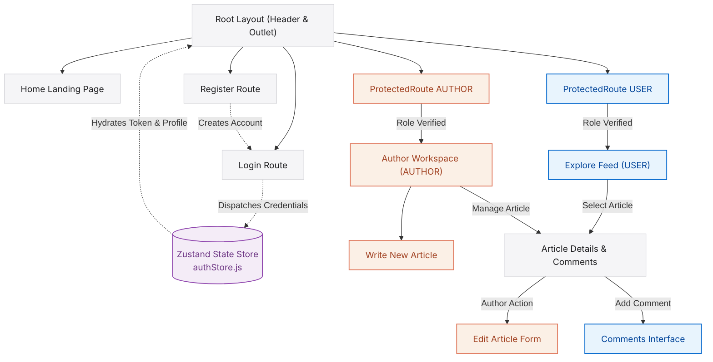

# Blog App Client — Premium React 19 Frontend

[](https://react.dev/)
[](https://vite.dev/)
[](https://tailwindcss.com/)
[](https://github.com/pmndrs/zustand)
[](https://reactrouter.com/)

 **Live Production Deploy:** [week-5-capstone-project-1.vercel.app](https://week-5-capstone-project-1.vercel.app/)

Welcome to the **Blog App Frontend Client**—a premium, high-fidelity React 19 Single Page Application (SPA) designed to power the user-facing interface of the **Capstone Multi-Role Article Sharing Platform**. 

Inspired by **clean, modern web aesthetics and glassmorphism**, this client application is meticulously engineered around raw typography, strict layout constraints, crisp spacing, and smooth micro-animations. It operates seamlessly in multi-role environments (`USER` readers, `AUTHOR` creators, and `ADMIN` moderators), offering instant state synchronization, role-isolated dashboards, in-context comments threads, and bulletproof security guards.

---

## Core Architecture Highlights

### 1. Unified Design System (`src/styles/common.js`)
Rather than scattered styling helpers, the visual language is governed by a **centralized design token registry**. 
* **Pristine Canvas:** Pure backgrounds with soft card backings and elegant dividers.
* **Modern Typography:** Strict text hierarchies utilizing bold titles and muted secondary body typography.
* **Visual Premium Details:** Elegant `backdrop-blur` sticky navbars, thin borders, rounded-full pills, and integrated custom modals (`ConfirmModal.jsx`).
* **Vibrant Focus Elements:** The iconic premium blue for primary elements, active links, and brand buttons.

### 2. State Hydration & Token Reconciliation (`src/store/authStore.js`)
Powered by **Zustand**, global authentication state management is extremely robust:
* **Session Restoration:** On application reload or initial page load, a dedicated background hook (`checkAuth`) verifies the session with the `/common-api/check-auth` backend API before completing the render lifecycle, completely preventing flashing unauthenticated contents or premature redirects.
* **Instant Logout Cleanup:** On logout, both client state and local caches are cleanly purged, while simultaneously notifying the backend API to invalidate HTTP-only cookies.
* **Global Loading State Hooks:** Exposes unified loading and error boundaries so pages can smoothly render loading animations during state transitions.

### 3. Bulletproof Access Security (`src/components/ProtectedRoute.jsx`)
Client routes are guarded at the component level:
* **Isolated Roles:** Supports granular array-based permissions (e.g., `allowedRole={["AUTHOR"]}`).
* **Seamless Redirection:** Authenticates first, checking roles; if a regular reader tries to compromise creator endpoints, it seamlessly dispatches them to the login path with browser history replacement to prevent back-button loops.

### 4. Interactive Creators & Readers Dashboard
* **Dynamic Article Feed:** A fully customizable grid of articles with instant category-based rendering.
* **Author Control Center:** In-place publishing controls with validations, plus a dedicated **AuthorDashboard** for managing active and deactivated works.
* **Deep Dynamic Discussion Threading:** Features inside the single article view (`Article.jsx`) enabling users and authors to add comments.
* **Soft Deletes & Restores:** Authors can toggle article active states (deactivate vs. activate) with visual state updates, powered by a custom on-screen `ConfirmModal`.

---

## Client Navigation & State Architecture

This diagram visualizes the application's page structure, route protection, and Zustand state synchronization:



---

## Project Directory Structure

```text
BLOG-APP-FRONTEND/
├── index.html # HTML shell and entry point
├── src/
│ ├── components/ # Page Views and Structural Layout Components
│ │ ├── AddArticle.jsx # Form creator with validations
│ │ ├── AdminDashboard.jsx # Moderation view for administrators
│ │ ├── Article.jsx # Detailed article page (renders post and comments)
│ │ ├── ArticleCard.jsx # Card component for grid displays
│ │ ├── Articles.jsx # Grid wrapper for ArticleCard components
│ │ ├── AuthorDashboard.jsx # Workspace for active/deactivated articles
│ │ ├── ConfirmModal.jsx # Custom Apple-style confirmation modal
│ │ ├── EditArticle.jsx # Managed editor for updating published stories
│ │ ├── ErrorBoundary.jsx # Global error catcher for component failures
│ │ ├── Header.jsx # Sticky navigation bar with role-based links
│ │ ├── Home.jsx # Elegant marketing home landing page
│ │ ├── Login.jsx # Secure login form with validation
│ │ ├── ProtectedRoute.jsx # Security gate guarding routes from unauthorized roles
│ │ ├── Register.jsx # Multi-role account creator with image uploading
│ │ └── UserDashboard.jsx # Reader dashboard with article grids
│ ├── store/ # Centralized State Management
│ │ └── authStore.js # Zustand global state (handles checkAuth, tokens, login & logout)
│ ├── styles/ # Application Theme styling
│ │ └── common.js # Centralized CSS class dictionary
│ ├── App.jsx # React Router v7 routes definition tree
│ ├── index.css # Tailwind CSS directives & custom fonts
│ └── main.jsx # App bootstrapper
├── .env # Client environment settings (VITE_API_URL)
├── .gitignore # Files excluded from Git tracking
├── package.json # Package dependencies, build scripts
└── vite.config.js # Vite config (React and Tailwind plugins)
```

---

## Tech Stack & Key Dependencies

This project leverages a state-of-the-art modern frontend stack:
* **React 19.2.0:** Utilizing modern React hooks (`useEffect`, `useState`, `useLocation`, `useParams`).
* **Vite 7.3.1:** High-speed development server and optimized rollup production bundling.
* **Tailwind CSS 3.4.19:** Rapid utility-first styling and responsive layouts.
* **Zustand 5.0.11:** Lightweight, scalable, hooks-based global state management.
* **React Router 7.13.1:** Client-side declarative routing and sub-route nested outlets.
* **React Hot Toast 2.6.0:** Beautiful, responsive alerts and notification alerts.
* **Axios 1.13.6:** HTTP client configured with bearer headers and cookie-handshake support.

---

## Environment Configuration

To run this application locally, create a `.env` file in the root `BLOG-APP-FRONTEND` directory. Vite requires client environment variables to be prefixed with `VITE_` to compile them into the final static build:

```ini
# Base Endpoint URL of the Running Backend Express API
VITE_API_URL=http://localhost:4000
```

---

## Local Sandbox Setup Guide

### 1. Prerequisites
Ensure you have the following installed on your operating system:
* **Node.js** (v18.x or v20.x recommended)
* **npm** (v9.x or v10.x)

### 2. Clone and Install Dependencies
Navigate into the frontend project directory and restore all packages:
```bash
cd BLOG-APP-FRONTEND
npm install
```

### 3. Run Development Server
Spin up the local Vite dev server:
```bash
npm run dev
```
Once initialized, the CLI will output the local network URL (typically `http://localhost:5173`). Open this link in your web browser.

### 4. Build for Production
To package the app into highly optimized, minified static files inside the `/dist` directory, run:
```bash
npm run build
```

---

## Backend API Handshake Specifications

All outgoing HTTP calls made via **Axios** adhere to the following security protocols:
1. **Cookie Inclusion:** Enable `withCredentials: true` in all axios calls to ensure secure CORS-compliant handshake configurations (HTTP-only JWT cookies mapped by the backend).
2. **Common API Mappings:**
 * **Login Request:** `POST /common-api/login`
 * **Logout Request:** `GET /common-api/logout`
 * **Session Restore:** `GET /common-api/check-auth`
 * **Public Feed:** `GET /user-api/articles`
 * **Authors Articles:** `GET /author-api/articles/:authorId`
 * **Publish Article:** `POST /author-api/articles`
 * **Activate/Deactivate:** `PUT /author-api/articles/activate` & `/deactivate`

---

## Production Deployment Guidelines

This full-stack application is optimized for split production hosting:
* **Frontend SPA:** Hosted on **Vercel** for high-speed edge distribution.
* **Backend API Server:** Hosted on **Vercel** or **Render** as a managed Web Service.

### Frontend Deployment: Vercel

Vercel provides native support for Vite-based SPAs. Configure your deployment as follows:

#### 1. Import Repository & Project Settings
When importing your repository in Vercel:
* **Root Directory:** **Set to `BLOG-APP-FRONTEND`**. This ensures Vercel looks in the correct directory for your `package.json` and build config.
* **Framework Preset:** Select **Vite** (Vercel will auto-detect this).
* **Build Command:** `npm run build`
* **Output Directory:** `dist`

#### 2. Environment Variables
Add the following key-value pair in your Vercel Project Settings under **Environment Variables**:
* **Key:** `VITE_API_URL`
* **Value:** `https://blog-app-api-peach-gamma.vercel.app` *(your live backend URL without a trailing slash)*

#### 3. Single Page Application (SPA) Routing Rewrite
Because React Router manages routing dynamically on the client side, accessing page routes directly by URL will throw a `404 Not Found` error unless Vercel redirects all paths back to `index.html`.

To enable seamless SPA routing on Vercel, a **`vercel.json`** file is configured (or can be configured) in the root of the frontend directory:
```json
{
 "rewrites": [
 { "source": "/(.*)", "destination": "/index.html" }
 ]
}
```

---
*Designed with modern UI/UX principles for the ultimate reading and writing experience.*
